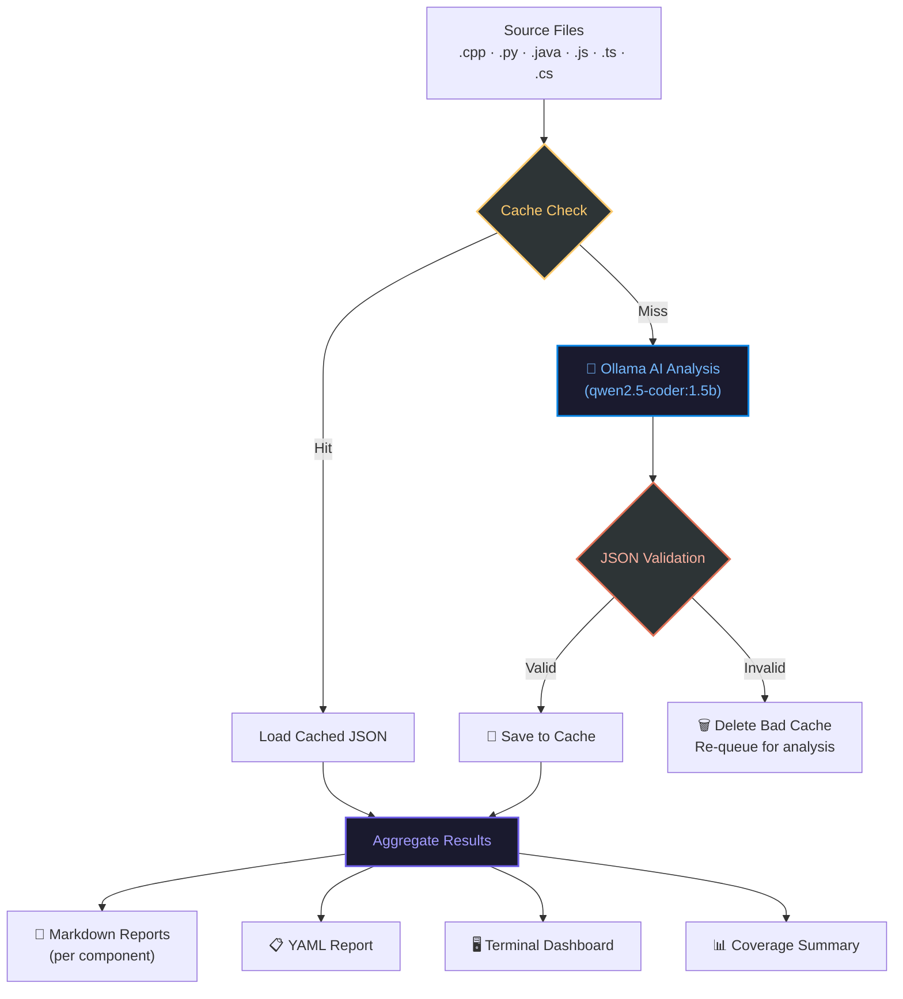

<div align="center">

# GenTestAI

### *AI-Powered code Analysis & Test Generation Tool*

**GenTestAI** is an AI-powered static code analysis tool for software projects that automatically generates test scenarios and predicts code coverage — **without compiling or executing any code**.

[](https://python.org)
[](https://ollama.ai)
[](https://ollama.com/library/qwen2.5-coder)
[](LICENSE)
[]()

> **No compilers. No linkers. No build steps. No cloud APIs.**  
> Just your code, a local LLM, and intelligent analysis.

</div>

---

## 📖 Table of Contents

- [What Is GenTestAI?](#-what-is-gentestai)
- [How It Works](#️-how-it-works)
- [System Architecture](#-system-architecture)
- [Project Structure](#-project-structure)
- [Core Features & Stability](#-core-features--stability)
- [Supported Languages](#-supported-languages)
- [AI Analysis Output Format](#-ai-analysis-output-format)
- [Generated Reports](#-generated-reports)
- [Getting Started](#-getting-started)
- [Configuration](#️-configuration)
- [Sample Output](#-sample-output)
- [Limitations](#️-limitations)
- [Troubleshooting](#-troubleshooting)
- [Contributing](#-contributing)
- [License](#-license)

---

## 🤖 What Is GenTestAI?

GenTestAI is a **zero-execution code intelligence tool** that bridges the gap between writing code and testing it. Traditional test coverage tools require you to:

1. Build your project
2. Write tests manually
3. Execute those tests
4. Instrument the runtime

**GenTestAI eliminates all of that.**

It reads your raw source files, sends them to a locally-running AI model (via [Ollama](https://ollama.ai)), and gets back a structured JSON report containing:

- 🧪 Suggested unit test cases — specific to your actual functions and logic
- 📊 Estimated line coverage percentage — predicted without running a single line
- 🏷️ Component classification — Controller, Model, Service, Utility, etc.
- ⚠️ Potential testing pitfalls — tight coupling, global state, hard-coded dependencies
- 🔧 Actionable refactoring recommendations — to improve testability before writing tests

This is especially powerful during **early development**, **code reviews**, **onboarding**, or when dealing with **legacy codebases** where running tests is not yet feasible.

---

## ⚙️ How It Works

GenTestAI follows a clean, deterministic 5-stage pipeline:

### Stage 1 — Source Discovery
The engine walks the `src/` directory recursively and collects all supported source files. It skips `third_party/` directories automatically to avoid analyzing vendored code.

```
src/
├── calculator.cpp        ← Collected ✅
├── user_model.cpp        ← Collected ✅
├── AccountModel.js       ← Collected ✅
├── TransactionProcessor.java ← Collected ✅
└── third_party/          ← Skipped 🚫
```

### Stage 2 — Cache-First Lookup
Before hitting the AI model, the engine checks a local file-based cache (`cache/`). If a valid, previously-analyzed result exists for a file, it is loaded instantly — **no LLM call needed**. This makes re-runs dramatically faster and enables iterative workflows.

Cache files are stored as `cache/<filename>.log`. Only **validated JSON** is ever written to cache — malformed or hallucinated AI responses are automatically rejected and the cache entry deleted for re-analysis.

### Stage 3 — AI Analysis via Ollama
For files not in cache, the engine:

1. Reads the full source code content
2. Loads the structured prompt template from `prompt/generate_report.yaml`
3. Injects the file name and source code into the prompt
4. Sends the composed prompt to the Ollama REST API (`http://localhost:11434/api/generate`)
5. Waits up to **120 seconds** for a response, with **up to 3 retries** on failure (exponential backoff: 5s → 10s → 20s)

The AI model (`qwen2.5-coder:1.5b`) is instructed through a hardened prompt to return **strictly valid JSON only** — no markdown fences, no surrounding text, no explanations. The prompt enforces this with a `CRITICAL REMINDER` footer.

### Stage 4 — JSON Validation & Caching
The raw LLM response string is scanned to extract the JSON object (from the first `{` to the last `}`). This is then parsed with Python's `json.loads()`. If parsing succeeds, the result is:

- Saved to the cache for future runs
- Added to the aggregated analysis list

If parsing fails (invalid JSON from the model), the cache entry is **automatically deleted** so the next run re-queries the model fresh, rather than serving corrupt cached data.

### Stage 5 — Multi-Format Report Generation
Once all files are analyzed and aggregated, the engine generates three simultaneous report formats:

| Format | Location | Purpose |
|--------|----------|---------|
| **Markdown (per component)** | `report/component_analysis/*.md` | Detailed, human-readable per-component breakdown |
| **Markdown (summary)** | `report/coverage_summary_report.md` | Overall project coverage overview |
| **YAML** | `report/coverage_report.yaml` | Machine-readable structured output for CI/CD integration |
| **Terminal** | stdout | Instant at-a-glance coverage table printed to the console |

---

## 🧠 System Architecture

The system follows a modular, build-free pipeline powered by local LLM inference:



### Module Responsibilities

| Module | File | Responsibility |
|--------|------|----------------|
| **Orchestrator** | `app/main.py` | Drives the full pipeline end-to-end |
| **Config** | `app/config.py` | Centralizes all paths, model name, and API endpoint |
| **LLM Handler** | `app/llm_handler.py` | Manages Ollama API calls, prompt generation, retry logic |
| **Report Generator** | `app/report_generator.py` | Aggregates analyses and emits all report formats |
| **Prompt Template** | `prompt/generate_report.yaml` | YAML-defined AI instruction with strict JSON output rules |

---

## 📁 Project Structure

```
GenTestAI/
│
├── app/                          # Core application package
│   ├── __init__.py
│   ├── main.py                   #  Pipeline orchestrator — entry point
│   ├── config.py                 #  All paths, model config, API endpoint
│   ├── llm_handler.py            #  Ollama API interface with retry + backoff
│   └── report_generator.py      #  Markdown, YAML, and terminal report builder
│
├── prompt/
│   └── generate_report.yaml     #  Hardened AI prompt template (JSON-enforced)
│
├── src/                          #  Drop your source files here
│   ├── calculator.cpp            #    Sample C++ file (included for quick testing)
│   ├── AccountModel.js           #    Sample JavaScript model
│   └── TransactionProcessor.java #    Sample Java processor
│
├── cache/                        #  Per-file LLM response cache (auto-managed)
│   └── <filename>.log            #    Cached JSON analysis per file
│
├── report/                       #  All generated reports land here
│   ├── coverage_summary_report.md   # Overall project coverage summary
│   ├── coverage_report.yaml         # Machine-readable YAML report
│   └── component_analysis/          # Per-component detailed breakdowns
│       ├── Controller.md
│       ├── Model.md
│       ├── Utility.md
│       └── ...
│
├── requirements.txt              # Python dependencies
└── README.md
```

---

## ✨ Core Features & Stability

GenTestAI is built to be **robust by design** — not just a demo. Every layer of the pipeline has explicit error handling:

| Feature | Detail | Status |
|---------|--------|--------|
| **Retry Logic** | Up to 3 attempts on API failure with exponential backoff (5s → 10s → 20s) | ✅ |
| **Request Timeout** | 120-second per-request timeout to prevent indefinite hangs | ✅ |
| **JSON Validation** | Responses are parsed before caching — invalid JSON is never stored | ✅ |
| **Auto-Delete Bad Cache** | Corrupt or unparseable cache entries deleted automatically on next run | ✅ |
| **Prompt JSON Enforcement** | Prompt ends with a `CRITICAL REMINDER` to guarantee pure JSON output | ✅ |
| **File-Based Caching** | Per-file cache prevents redundant LLM calls across runs | ✅ |
| **Third-Party Skip** | `third_party/` directories are ignored automatically | ✅ |
| **Multi-Language Support** | Scans `.cpp`, `.py`, `.js`, `.ts`, `.java`, `.cs`, `.c`, `.h`, `.hpp` | ✅ |
| **Graceful Failure** | Files that fail analysis are skipped; pipeline continues | ✅ |
| **Lightweight Model** | `qwen2.5-coder:1.5b` — fast, low-memory, runs on consumer hardware | ✅ |

---

## 🌐 Supported Languages

GenTestAI is **language-agnostic** for static analysis. It currently detects and processes:

| Language | Extensions |
|----------|-----------|
| C / C++ | `.c`, `.cpp`, `.cc`, `.cxx`, `.h`, `.hpp` |
| Python | `.py` |
| JavaScript | `.js` |
| TypeScript | `.ts` |
| Java | `.java` |
| C# | `.cs` |

> Support for additional languages can be added in `app/main.py` by extending the extension list in `findCppFiles()`.

---

## 🔬 AI Analysis Output Format

For each source file, the AI returns a structured JSON object. This is what drives all downstream reports:

```json
{
  "file_name": "calculator.cpp",
  "component": "Utility",
  "summary": "Implements basic arithmetic operations (add, subtract, multiply, divide) with divide-by-zero guard.",
  "testability_score": {
    "score": 9,
    "justification": "Pure functions with no external dependencies. Ideal for unit testing."
  },
  "suggested_test_cases": [
    "Test add(2, 3) returns 5",
    "Test subtract(10, 4) returns 6",
    "Test multiply(0, 99) returns 0",
    "Test divide(10, 2) returns 5.0",
    "Test divide(5, 0) throws or returns error sentinel"
  ],
  "estimated_line_coverage": "92%",
  "potential_issues": [
    "Division by zero is partially guarded — edge cases may not all be covered",
    "No boundary tests for integer overflow on large inputs"
  ],
  "recommendations": [
    "Add parameterized tests to cover the full arithmetic function surface",
    "Consider returning a Result/Optional type from divide() instead of a raw value"
  ]
}
```

### Output Fields Explained

| Field | Type | Description |
|-------|------|-------------|
| `file_name` | `string` | Name of the analyzed file |
| `component` | `string` | Classified role: Controller, Model, Service, Utility, Main, Config |
| `summary` | `string` | One-sentence description of what the file does |
| `testability_score.score` | `int (1–10)` | How easily can this file be unit tested? (10 = easiest) |
| `testability_score.justification` | `string` | Why this score was assigned |
| `suggested_test_cases` | `string[]` | Concrete, code-specific test scenarios to implement |
| `estimated_line_coverage` | `string` | Predicted line coverage percentage if suggested tests are written |
| `potential_issues` | `string[]` | Patterns that could make testing harder |
| `recommendations` | `string[]` | Actionable refactoring or testing strategy advice |

---

## 📊 Generated Reports

### 1. Terminal Dashboard (Live)
Printed directly to the console at the end of every run:

```
============================================================
              ESTIMATED CODE COVERAGE REPORT
============================================================
Component                      |   Estimated Coverage
------------------------------------------------------------
Utility                        |               87.00%
Service                        |               50.00%
Controller                     |               95.00%
Model                          |              100.00%
------------------------------------------------------------
OVERALL ESTIMATED COVERAGE     |               83.00%
============================================================

RECOMMENDATIONS:
  1. Extract dependency injection for better testability
  2. Add parameterized tests for boundary conditions
  3. Mock external service calls in Controller layer
```

### 2. Markdown Summary Report (`report/coverage_summary_report.md`)
A clean, human-readable project-level report aggregating all component scores, overall coverage, and consolidated recommendations.

### 3. Per-Component Markdown (`report/component_analysis/<Component>.md`)
One file per component type (e.g., `Utility.md`, `Model.md`), listing each analyzed file with its summary, testability score, estimated coverage, and full suggested test case list.

### 4. YAML Report (`report/coverage_report.yaml`)
Machine-readable, CI/CD-friendly structured output:

```yaml
project_summary: This report was generated by analyzing each source file individually and aggregating the results.
final_coverage_report:
  coverage_by_component:
    - component: Utility
      coverage: '87.00%'
    - component: Service
      coverage: '50.00%'
    - component: Controller
      coverage: '95.00%'
    - component: Model
      coverage: '100.00%'
  overall_estimated_coverage: '83.00%'
  recommendations:
    - Extract dependency injection for better testability
    - Add parameterized tests for boundary conditions
```

---

## 🚀 Getting Started

### 1. Clone the Repository

```bash
git clone https://github.com/mimraj-ai1/GenTest-Engine.git
cd GenTest-Engine
```

### 2. Install Ollama & Pull the Model

Download from [ollama.ai](https://ollama.ai), then:

```bash
ollama pull qwen2.5-coder:1.5b
```

### 3. Install Python Requirements

```bash
pip install -r requirements.txt
```

### 4. Add Your Source Files

Place your code files into the `src/` folder.
A sample `calculator.cpp` is included for quick testing.

### 5. Run the Analyzer

```bash
python -m app.main
```

---

## ⚙️ Configuration

All configuration lives in `app/config.py`:

```python
import os

rootDirectory    = os.path.dirname(os.path.dirname(os.path.abspath(__file__)))
sourceDirectory  = os.path.join(rootDirectory, 'src')       # Where to scan for source files
reportDirectory  = os.path.join(rootDirectory, 'report')    # Where reports are saved
cacheDirectory   = os.path.join(rootDirectory, 'cache')     # Where LLM responses are cached
promptDirectory  = os.path.join(rootDirectory, 'prompt')    # Where prompt templates live

llmApiEndpoint   = 'http://localhost:11434/api/generate'    # Ollama API endpoint
llmModelName     = 'qwen2.5-coder:1.5b'                    # Model to use for analysis
```

### Switching Models

To use a more powerful model (at the cost of speed/memory), change `llmModelName`:

```python
# Use a larger coder model for higher-quality analysis
llmModelName = 'qwen2.5-coder:7b'

# Or use a general-purpose model
llmModelName = 'llama3.2:3b'
```

Pull any Ollama model with:

```bash
ollama pull <model-name>
```

---

## 📸 Sample Output


---

## ⚠️ Limitations

- No actual test execution — static analysis only
- Output quality depends on the LLM used
- Large files may hit token limits

---

## 🧰 Troubleshooting

**Ollama not running?**
```bash
ollama serve
```

**Model not found?**
```bash
ollama pull qwen2.5-coder:1.5b
```

---

## 📜 License

This project is licensed under the MIT License.

---

### 🤝 Contributing

- Fork the repo
- Create a new branch
- Submit a pull request with your changes

---

<div align="center">

**Built with 🧠 AI · 🐍 Python · 🦙 Ollama**

*GenTestAI — because tests should start before you write them.*

</div>
